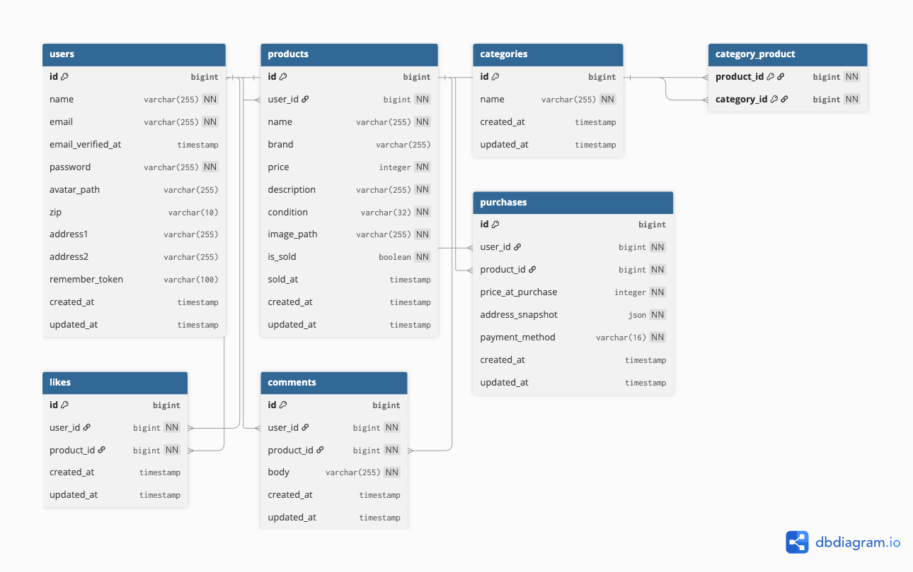

# 🛠️ coachtechフリマ

---

## ⚙️ 環境構築手順

## 🐳 1. Docker ビルド
git clone https://github.com/hiro869/frema-app.git

cd frema-app

docker compose up -d --build

## 🌱 2. Laravel セットアップ

docker compose exec app bash -lc "cd /var/www/html/src && composer install"

cp src/.env.example src/.env

## 🧾 3. .env 設定（以下のように変更してください）

APP_NAME=Frema

APP_ENV=local

APP_KEY=base64:VKl3W9kmL3LlS5R2a8XZIwMaeI23bTNja60Tv55wtHc=

APP_DEBUG=true

APP_TIMEZONE=Asia/Tokyo

APP_URL=http://localhost

APP_LOCALE=ja

APP_FALLBACK_LOCALE=ja

APP_FAKER_LOCALE=ja_JP

APP_MAINTENANCE_DRIVER=file

LOG_CHANNEL=stack

LOG_LEVEL=debug

DB_CONNECTION=mysql

DB_HOST=mysql

DB_PORT=3306

DB_DATABASE=laravel

DB_USERNAME=laravel

DB_PASSWORD=laravel

SESSION_DRIVER=database

SESSION_LIFETIME=120

BROADCAST_CONNECTION=log

FILESYSTEM_DISK=public

QUEUE_CONNECTION=database

CACHE_STORE=database

REDIS_CLIENT=phpredis

REDIS_HOST=127.0.0.1

REDIS_PORT=6379

MAIL_MAILER=smtp

MAIL_HOST=mailhog

MAIL_PORT=1025

MAIL_USERNAME=null

MAIL_PASSWORD=null

MAIL_ENCRYPTION=null

MAIL_FROM_ADDRESS="no-reply@example.test"

MAIL_FROM_NAME="${APP_NAME}"

AWS_ACCESS_KEY_ID=

AWS_SECRET_ACCESS_KEY=

AWS_DEFAULT_REGION=ap-northeast-1

AWS_BUCKET=

AWS_USE_PATH_STYLE_ENDPOINT=false

VITE_APP_NAME="${APP_NAME}"

STRIPE_KEY=pk_test_XXXXXXXXXXXXXXXXXXXX

STRIPE_SECRET=sk_test_XXXXXXXXXXXXXXXXXXXXXX

## ⚙️ 4. コマンド実行

docker compose exec app bash -lc "cd /var/www/html/src && php artisan key:generate"

docker compose exec app bash -lc "cd /var/www/html/src && php artisan migrate --seed"

docker compose exec app bash -lc "cd /var/www/html/src && php artisan storage:link"

docker compose exec app bash -lc "cd /var/www/html/src && php artisan optimize:clear"

## 🧩 よくある問題と対処

## ❌ 画像アップロードが反映されない場合

PHP設定（docker/php/conf.d/uploads.ini）

file_uploads = On

upload_max_filesize = 20M

post_max_size = 20M

Nginx設定（docker/nginx/default.conf）

client_max_body_size 20M;

設定変更後

docker compose restart app nginx

⚠️ 419 Page Expired

@csrf がフォーム内に無い場合に発生します。

<form action="{{ route('profile.update') }}" method="POST" enctype="multipart/form-data">
  @csrf
  @method('PATCH')
</form>

⚙️ storage:link のエラー

The [public/storage] link already exists. は 無視OK（既にリンク済み）。

🧠 .envを変更した後の反映コマンド
docker compose exec app bash -lc "cd /var/www/html/src && php artisan config:clear && php artisan cache:clear && php artisan optimize:clear"
docker compose restart app

## 補足

※ Stripe決済は開発用テストキーを使用しています。

自分の環境で購入処理を試す場合は、Stripeアカウントを作成し、

取得したテストキーを `.env` に設定してください。

※ テストケースについて

主要機能に対してPHPUnitを用いたテストを実装しました。

対応してるテストの内容

テスト名　　　　　　　　内容

RegisterTest	　　会員登録のバリデーション・メール認遷移を確認

LoginTest	　　　　ログインの入力チェック・正常ログインの動作確認

ItemIndexTest	　　商品一覧で「SOLD」ラベルが正しく表示されることを確認

⚙️ テスト環境の設定

テストせんようの.env.testingを用意しています。

（DB_DATABASE=laravel_test でMySQLを使用）

🧭 テスト実行方法
以下のコマンドを順番に実行してください。

テスト用データベース作成（初回のみ）

docker compose exec mysql bash -lc "mysql -u root -proot -e 'CREATE DATABASE IF NOT EXISTS laravel_test;'"

テスト用マイグレーション

docker compose exec app bash -lc "cd /var/www/html/src && php artisan migrate:fresh --env=testing"

テスト実行

docker compose exec app bash -lc "cd /var/www/html/src && php artisan test --env=testing"

実行した時の例
PASS  Tests\Feature\Auth\RegisterTest

✓ 名前が未入力だと お名前を入力してください が表示される

✓ 正しい情報ならメール認証画面に遷移する

PASS  Tests\Feature\Auth\LoginTest

✓ 正しい情報ならログインできる

PASS  Tests\Feature\Item\ItemIndexTest

✓ 売却済み商品には SOLD ラベルが表示される

## 🌐 開発環境URL

種類	URL

アプリケーション	http://localhost/

Mailhog（メール確認）	http://localhost:8025

phpMyAdmin（DB確認）	http://localhost:8080

## 💻 使用技術（実行環境）

項目	内容

言語	PHP 8.3

フレームワーク	Laravel 11.x

Webサーバー	Nginx 1.25.3

データベース	MySQL 8.0.26

開発環境	Docker Compose

メール認証	Mailhog

決済	Stripe（テストモード）

## 🗺 ER図

